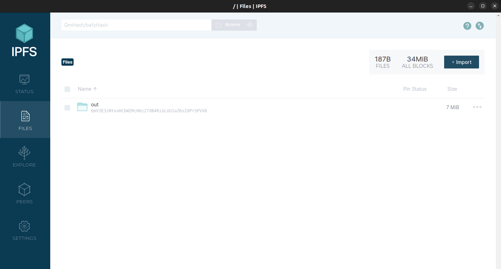
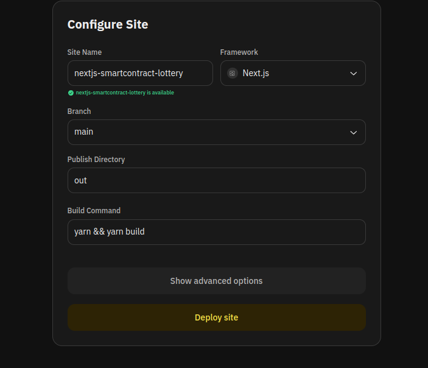

# Next.js Smart Contract Lottery

This project is a decentralized application (DApp) built with Next.js and Solidity. It allows users to participate in a lottery where a winner is picked randomly using Chainlink VRF (Verifiable Random Function).

## Table of Contents

1. [Deployments](#deployments)
2. [Access the Website hosted on IPFS](#access-the-website-hosted-on-ipfs)
    - [Brave](#brave)
    - [Google Chrome](#google-chrome)
    - [Firefox](#firefox)
    - [Other Browsers](#other-browsers)
3. [Installation](#installation)
4. [Usage](#usage)
5. [Features](#features)
6. [Technologies Used](#technologies-used)
7. [Deploy](#deploy)
    - [Deploy on IPFS](#deploy-on-ipfs)
    - [Deploy on IPFS through Fleek](#deploy-on-ipfs-through-fleek)
8. [Contributing](#contributing)
9. [License](#license)

## Deployments

-   IPFS through Fleek: [ipfs://bafybeihwxbv3fpgdqqpivob5xen63cdolv6ihobetmpmxshhwcd76nx5gq](https://bafybeihwxbv3fpgdqqpivob5xen63cdolv6ihobetmpmxshhwcd76nx5gq.ipfs.dweb.link/) (You need to have an IPFS extension enabled)
-   Fleek: [https://fat-gpu-crooked.on-fleek.app/](https://fat-gpu-crooked.on-fleek.app/)

Deployed using only IPFS Desktop:

-   IPFS: [ipfs://QmV3E3zNYvoHCbW2McH6z27dB4RiGLUU1aZ6sZdPrSPVX8](https://QmV3E3zNYvoHCbW2McH6z27dB4RiGLUU1aZ6sZdPrSPVX8.ipfs.dweb.link/)

> To see the website directly on IPFS, you need to have IPFS Desktop running or a local IPFS node enabled.

## Access the Website hosted on IPFS

### Brave

You can simply use the Brave IPFS node or install the [IPFS Companion Extension](https://chromewebstore.google.com/detail/ipfs-companion/nibjojkomfdiaoajekhjakgkdhaomnch).

### Google Chrome

Install the [IPFS Companion Extension](https://chromewebstore.google.com/detail/ipfs-companion/nibjojkomfdiaoajekhjakgkdhaomnch) from the Chrome Web Store.

### Firefox

Install the [IPFS Companion Extension](https://addons.mozilla.org/it/firefox/addon/ipfs-companion/) from Firefox Browser ADD-ONS.

### Other Browsers

Read the [IPFS Companion Install Documentation](http://bafybeie266mvmvkpt5bvvqp4mmmcwqv2obqzndlkqxbtmpnws2tdcn4iju.ipfs.localhost:8080/install/ipfs-companion/#install) to install the IPFS Companion on your preferred browser.

## Installation

To set up the project locally, follow these steps:

1. **Clone the repository**:

    ```bash
    git clone https://github.com/your-username/nextjs-smartcontract-lottery.git
    cd nextjs-smartcontract-lottery
    ```

2. **Install dependencies**:

    ```bash
    yarn install
    ```

3. **Spin Up hardhat node**

    > hardhat is not installed in this repository

    So you must do one of the following:

    - Have your own hardhat project.
    - Create a new hardhat project following the [hardhat official documentation](https://hardhat.org/hardhat-runner/docs/getting-started#overview).
    - Clone my repository [hardhat-smartcontract-lottery](https://github.com/mp-web3/hardhat-smartcontract-lottery) and follow the instructions in the README.md .

    Now run

    ```bash
    hardhat node
    ```

4. **Run the development server**:

    ```bash
    yarn dev
    ```

    Open [http://localhost:3000](http://localhost:3000) with your browser to see the result.

## Usage

-   **Connect Wallet**: Click on the "Connect Wallet" button to connect your Ethereum wallet.
-   **Switch Network**: If you are not on the Sepolia network, you will be prompted to switch.
-   **Enter Lottery**: Enter the lottery by paying the entrance fee.
-   **Check Winner**: The winner is picked randomly using Chainlink VRF.

## Features

-   **Decentralized Lottery**: Participate in a fair and transparent lottery.
-   **Chainlink VRF**: Ensures the randomness of the winner selection.
-   **Wallet Integration**: Connect your Ethereum wallet to interact with the DApp.
-   **Network Switching**: Automatically prompts the user to switch to the Sepolia network if not already connected.

## Technologies Used

-   **Next.js**: React framework for server-side rendering and static site generation.
-   **Solidity**: Programming language for writing smart contracts.
-   **Chainlink VRF**: Verifiable Random Function for generating random numbers.
-   **Web3uikit**: UI components for Web3 applications.
-   **Moralis**: Simplifies interaction with blockchain data.

## Deploy

### Deploy on IPFS

#### **Requirements**

-   IPFS Desktop

To install the correct version of IPFS Desktop, please read the docs [Install the IPFS Desktop App](https://docs.ipfs.tech/install/ipfs-desktop/).

#### **Deploy**

From the root repository (nextjs-smartcontract-lottery), run in the terminal:

```bash
yarn build
```

This will automatically export the static version of the website in the newly created "out" directory.

> Check out [Next.js documentation for Static Exports](https://nextjs.org/docs/pages/building-your-application/deploying/static-exports) to learn more.

Now:

-   Open IPFS Desktop
-   Click the "FILES" tab on the right
-   Click the Import Button
-   Select the "out" directory created after running `yarn build`

> Congrats! Now your website is officially hosted on IPFS



**Check out your website on your favorite browser!**

In IPFS Desktop, Files Tab:

-   Click the three dots on the right of the "out" directory
-   Click on "Copy CID"
-   Open your preferred browser
-   Paste the CID preceded by "ipfs://"

### Deploy on IPFS through Fleek

> Deploying on Fleek is easier and helps other nodes pinning our Website. Fleek deploys both on IPFS and on regular hosting.

-   Navigate to [Fleek](https://fleek.xyz/)
-   Sign up with your wallet
-   Click on "Deploy your Site"
-   Click on "Add New" -> "Deploy my site"
-   Click on GitHub, after authorizing you will be prompted to install "Fleek" on GitHub, do it
-   Now select the cloned "nextjs-smartcontract-lottery" repository
-   Click on "Deploy"



Now just wait for the deployment to finish.

## Contributing

Contributions are welcome! Please follow these steps to contribute:

1. Fork the repository.
2. Create a new branch (`git checkout -b feature-branch`).
3. Make your changes.
4. Commit your changes (`git commit -m 'Add some feature'`).
5. Push to the branch (`git push origin feature-branch`).
6. Open a pull request.

## License

This project is licensed under the MIT License. See the LICENSE file for details.
